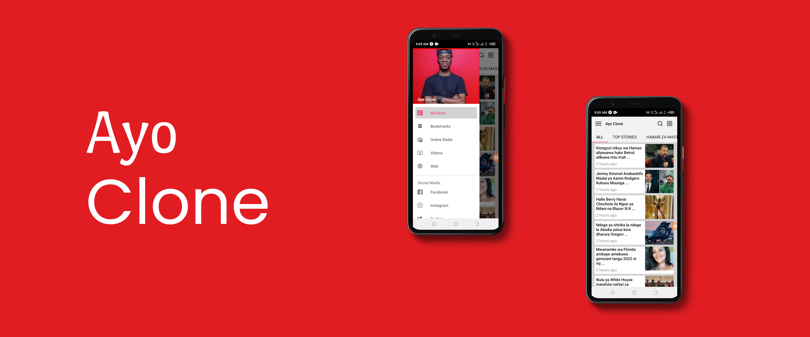
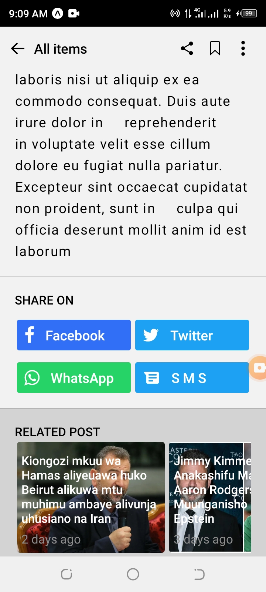
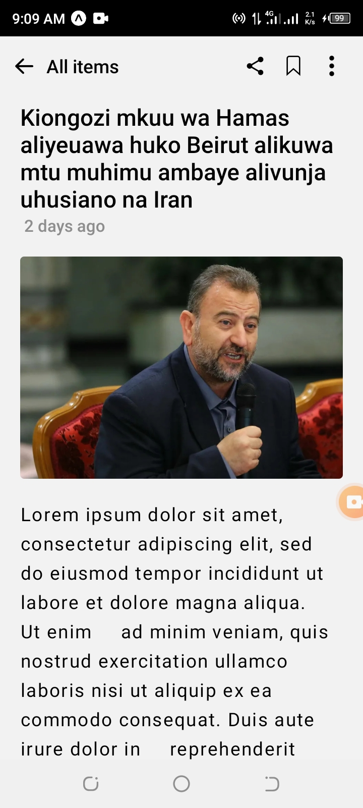
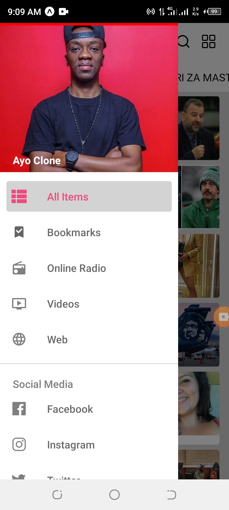

# Preview

Ayo Blog or Ayo clone build in React Native

## Tech

**React Native**  
**Redux**  

## Development

Here are these steps to run the project locally

1. Clone the repository
   git clone https://github.com/isayaexavery/ayo-blog.git

2. Install dependancies
   npm install

3. Finally ,   `npx expo start`

  
  
 

# ScreenShots

 
  
 
  

  
  
